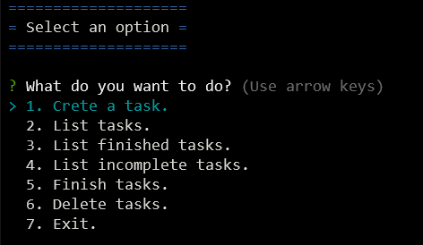
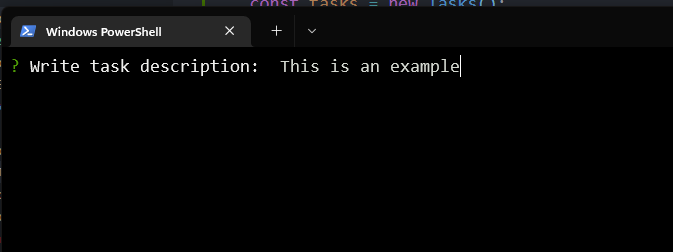

# Interactive console application.

## Introduction

In this small application, some libraries are tested to try to imitate interactive applications (such as the angular CLI) and others that allow them to be more eye-catching for the user and much more friendly.

Although the application is the classic "TO DO app", the main intention is to familiarize the libraries, asynchronous programming (based on async/await promises) and lay some foundations for what will be an application in the future that will create projects in node.js automatically and with little interaction.

## Dependencies
For this application, the famous npm "colors" package has been used, this allows us to use colors in the console.

To generate the interactive menus, "inquirer" has been used, which is responsible for adding interactivity to the console applications.

To generate unique id's, we use uuid library.


## Installation.

It is only necessary to install the list of dependencies, for this it is enough to run in terminal:

```bash
npm install
```

## Usage

Execute the applitacion with (position yourself in the application folder with the console or through your editor):

```bash
node app.js

```
You should see something like this:




Once the application is launched, it is only necessary to enter the description of the task (you can use the number one or the arrow keys on the keyboard). Subsequently, it is only necessary to enter the name of the task, in case the name is empty, a validation error will be thrown.




